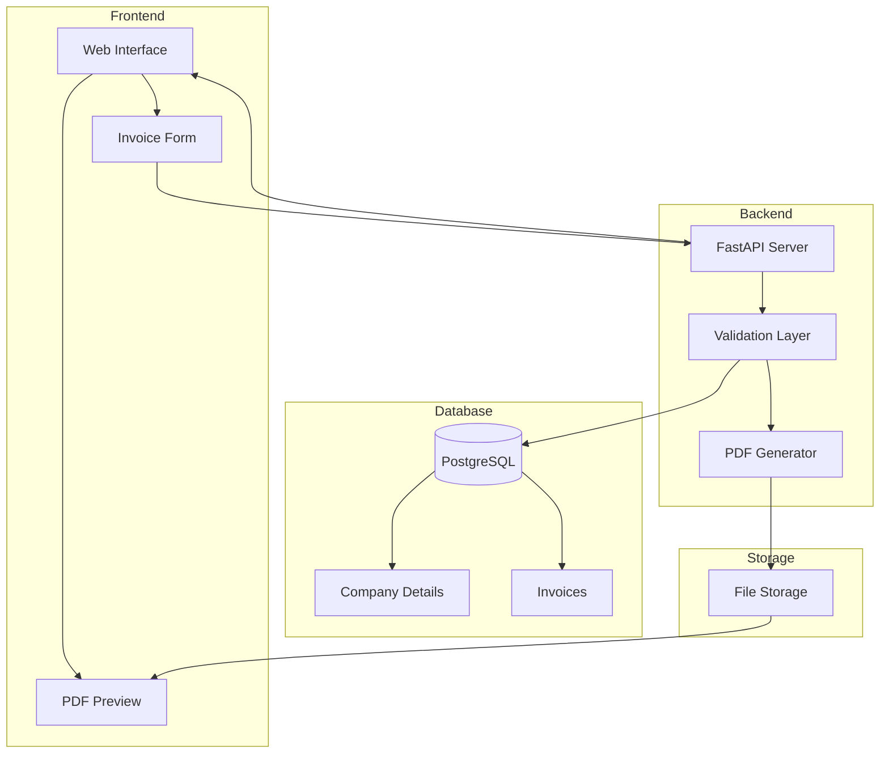

# Invoice System Architecture

## Data Flow
1. User inputs data through web interface
2. Data validated by backend
3. Invoice generated and stored as PDF
4. Invoice details saved to database
5. PDF path stored in database
6. Invoice accessible for viewing/downloading
